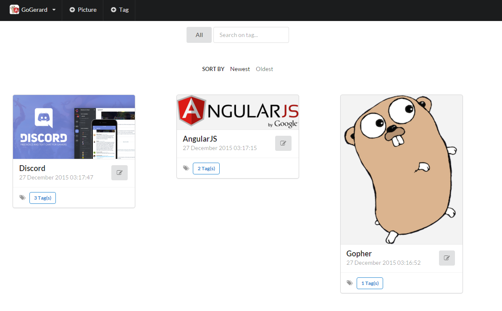

# GerardJS
A modern bot for Discord - The Web Interface

----------

## GoGerard

Project details can be found on the [main repo.](https://github.com/GoGerard/GoGerard)

----------

### GerardJS ###

The webinterface is written in Front-End Webdevelopment languages like HTML, CSS and Javascript, and is very dependent on:

 - [AngularJS](https://angularjs.org/) - 'Superheroic JavaScript MVW Framework'
 - [Semantic UI](http://semantic-ui.com/) - 'Semantic is a UI component framework based around useful principles from natural language. 
 

#### How to use?

- Fill in the base URL (as seen by the client) of GerardAPI in /assets/js/app.js
- For example: `var api_prefix = 'http://localhost:8080';`
- Serve the folder using an HTTP server like Apache or Nginx
- More information and instructions using a Nginx container will follow
